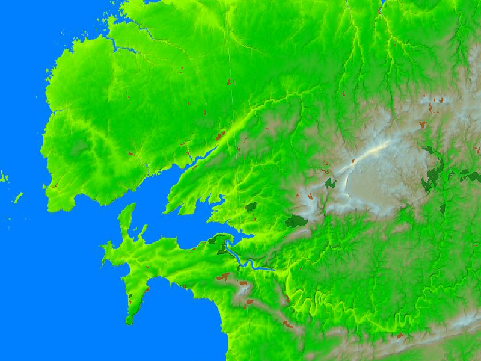

# Examples

## WMS

```` c++
| wms operations getmap layers size map |

"Create a WMS client targeting the IGN WMS server"
wms := OWSServiceWMS new.
wms url: 'https://data.geopf.fr/wms-r'.

"Introspect the server capabilities"
operations := wms operations.

# 'operations' is a XMLOrderedList(
#   a OWSServiceWMSOperation <GetCapabilities>
#   a OWSServiceWMSOperation <GetMap>
#   a OWSServiceWMSOperation <GetFeatureInfo>
# )

"Listing available image formats for maps"
getmap := operations detect: [ :request | request name = 'GetMap' ].
getmap formats.

# 'formats' is an OrderedCollection(
#   image/jpeg
#   image/png
#   image/tiff
#   image/geotiff
#   image/x-bil;bits=32
# )

"Listing available layers"
layers := wms layers.

# 'layers' is a XMLOrderedList(
#   a OWSServiceWMSLayer(ADMINEXPRESS-COG-CARTO.LATEST)
#   a OWSServiceWMSLayer(ADMINEXPRESS-COG.2017)
#   [...]
# )

"Download a raster map with two layers for a bounding box defined by EPSG:3857 coordinates"
map := wms
  map: { 'EL.GridCoverage'. 'FORETS.PUBLIQUES' }
  bbox: (-546079 @ 6126282 corner: -398839 @ 6212047)
  size: 800 @ 600
  epsg: '3857'
  format: 'image/png'.

# 'map' is a Bitmap
````


